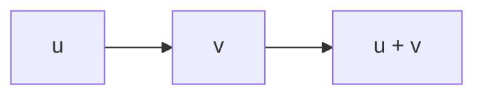

## 1A $\mathbf { R } ^ { n }$ and $\mathbf { C } ^ { n }$

## Complex Numbers

You should already be familiar with basic properties of the set 𝐑 of real numbers. Complex numbers were invented so that we can take square roots of negative numbers. The idea is to assume we have a square root of −1, denoted by 𝑖, that obeys the usual rules of arithmetic. Here are the formal definitions.

## 1.1 definition: complex numbers, 𝐂

• A complex number is an ordered pair $( a , b )$ , where 𝑎, $b \in \mathbf { R }$ , but we will write this as $a + b i .$  
• The set of all complex numbers is denoted by 𝐂:

$$
\mathbf {C} = \{a + b i: a, b \in \mathbf {R} \}.
$$

• Addition and multiplication on 𝐂 are defined by

$$
\begin{array}{l} (a + b i) + (c + d i) = (a + c) + (b + d) i, \\ (a + b i) (c + d i) = (a c - b d) + (a d + b c) i; \\ \end{array}
$$

here $a , b , c , d \in \mathbf { R } .$ .

If $a \in \mathbf { R }$ , we identify $a + 0 i$ with the real number 𝑎. Thus we think of 𝐑 as a subset of 𝐂. We usually write $0 + b i$ as just 𝑏𝑖, and we usually write $0 + 1 i$ as just 𝑖.

To motivate the definition of complex multiplication given above, pretend that we knew that $i ^ { 2 } = - 1$ and then use the

The symbol 𝑖 was first used to denote √−1 by Leonhard Euler in 1777.

usual rules of arithmetic to derive the formula above for the product of two complex numbers. Then use that formula to verify that we indeed have

$$
i ^ {2} = - 1.
$$

Do not memorize the formula for the product of two complex numbers—you can always rederive it by recalling that $i ^ { 2 } = - 1$ and then using the usual rules of arithmetic (as given by 1.3). The next example illustrates this procedure.

## 1.2 example: complex arithmetic

The product $( 2 + 3 i ) ( 4 + 5 i )$ can be evaluated by applying the distributive and commutative properties from 1.3:

$$
\begin{array}{l} (2 + 3 i) (4 + 5 i) = 2 \cdot (4 + 5 i) + (3 i) (4 + 5 i) \\ = 2 \cdot 4 + 2 \cdot 5 i + 3 i \cdot 4 + (3 i) (5 i) \\ = 8 + 1 0 i + 1 2 i - 1 5 \\ = - 7 + 2 2 i. \\ \end{array}
$$

Our first result states that complex addition and complex multiplication have the familiar properties that we expect.

## 1.3 properties of complex arithmetic

## commutativity

$$
\alpha + \beta = \beta + \alpha \text {and} \alpha \beta = \beta \alpha \text {for all} \alpha , \beta \in \mathbf {C}.
$$

## associativity

$$
(\alpha + \beta) + \lambda = \alpha + (\beta + \lambda) \text {and} (\alpha \beta) \lambda = \alpha (\beta \lambda) \text {for all} \alpha , \beta , \lambda \in \mathbf {C}.
$$

## identities

$$
\lambda + 0 = \lambda \text {and} \lambda 1 = \lambda \text {for all} \lambda \in \mathbf {C}.
$$

## additive inverse

For every $\alpha \in \mathbf { C } .$ there exists a unique $\beta \in \mathbf { C }$ such that $\alpha + \beta = 0 .$

## multiplicative inverse

For every $\alpha \in \mathbf { C }$ with $\alpha \neq 0 ,$ there exists a unique $\beta \in \mathbf { C }$ such that $\alpha \beta = 1$ .

## distributive property

$$
\lambda (\alpha + \beta) = \lambda \alpha + \lambda \beta \text {for all} \lambda , \alpha , \beta \in \mathbf {C}.
$$

The properties above are proved using the familiar properties of real numbers and the definitions of complex addition and multiplication. The next example shows how commutativity of complex multiplication is proved. Proofs of the other properties above are left as exercises.

## 1.4 example: commutativity ofcomplex multiplication

To show that $\alpha \beta = \beta \alpha$ for all $\alpha , \beta \in \mathbf { C }$ , suppose

$$
\alpha = a + b i \quad \text { and } \quad \beta = c + d i,
$$

where $a , b , c , d \in \mathbf { R }$ . Then the definition of multiplication of complex numbers shows that

$$
\begin{array}{l} \alpha \beta = (a + b i) (c + d i) \\ = (a c - b d) + (a d + b c) i \\ \end{array}
$$

and

$$
\begin{array}{l} \beta \alpha = (c + d i) (a + b i) \\ = (c a - d b) + (c b + d a) i. \\ \end{array}
$$

The equations above and the commutativity of multiplication and addition of real numbers show that $\alpha \beta = \beta \alpha$

Next, we define the additive and multiplicative inverses of complex numbers, and then use those inverses to define subtraction and division operations with complex numbers.

## 1.5 definition: −𝛼, subtraction, 1/𝛼, division

Suppose 𝛼, $\beta \in \mathbf { C } .$

• Let −𝛼 denote the additive inverse of 𝛼. Thus −𝛼 is the unique complex number such that

$$
\alpha + (- \alpha) = 0.
$$

• Subtraction on 𝐂 is defined by

$$
\beta - \alpha = \beta + (- \alpha).
$$

• For $\alpha \neq 0 ,$ , let $1 / \alpha$ and $\frac { 1 } { \alpha }$ denote the multiplicative inverse of 𝛼. Thus $1 / \alpha$ is the unique complex number such that

$$
\alpha (1 / \alpha) = 1.
$$

• For $\alpha \neq 0 ,$ , division by 𝛼 is defined by

$$
\beta / \alpha = \beta (1 / \alpha).
$$

So that we can conveniently make definitions and prove theorems that apply to both real and complex numbers, we adopt the following notation.

## 1.6 notation: 𝐅

Throughout this book, 𝐅 stands for either 𝐑 or 𝐂.

Thus if we prove a theorem involving 𝐅, we will know that it holds when 𝐅 is replaced with 𝐑 and when 𝐅 is replaced with 𝐂.

The letter 𝐅 is used because 𝐑 and 𝐂 are examples ofwhat are calledfields.

Elements of 𝐅 are called scalars. The word “scalar” (which is just a fancy word for “number”) is often used when we want to emphasize that an object is a number, as opposed to a vector (vectors will be defined soon).

For $\alpha \in \mathbf { F }$ and 𝑚 a positive integer, we define $\alpha ^ { m }$ to denote the product of 𝛼 with itself 𝑚 times:

$$
\alpha^ {m} = \underbrace {\alpha \cdots \alpha} _ {m \text {times}}.
$$

This definition implies that

$$
(\alpha^ {m}) ^ {n} = \alpha^ {m n} \quad \text {and} \quad (\alpha \beta) ^ {m} = \alpha^ {m} \beta^ {m}
$$

for all $\alpha , \beta \in \mathbf { F }$ and all positive integers 𝑚, 𝑛.

## Lists

Before defining $\mathbf { R } ^ { n }$ and $\mathbf { C } ^ { n } ,$ we look at two important examples.

## 1.7 example: $\mathbf { R } ^ { 2 }$ and $\mathbf { R } ^ { 3 }$

• The set $\mathbf { R } ^ { 2 } ,$ which you can think of as a plane, is the set of all ordered pairs of real numbers:

$$
\mathbf {R} ^ {2} = \{(x, y): x, y \in \mathbf {R} \}.
$$

• The set $\mathbf { R } ^ { 3 } ,$ , which you can think of as ordinary space, is the set of all ordered triples of real numbers:

$$
\mathbf {R} ^ {3} = \{(x, y, z): x, y, z \in \mathbf {R} \}.
$$

To generalize $\mathbf { R } ^ { 2 }$ and $\mathbf { R } ^ { 3 }$ to higher dimensions, we first need to discuss the concept of lists.

## 1.8 definition: list, length

• Suppose 𝑛 is a nonnegative integer. A list of length 𝑛 is an ordered collection of 𝑛 elements (which might be numbers, other lists, or more abstract objects).  
• Two lists are equal if and only if they have the same length and the same elements in the same order.

Lists are often written as elements separated by commas and surrounded by parentheses. Thus a list of length two is

Many mathematicians call a list of length 𝑛 an 𝑛-tuple.

an ordered pair that might be written as (𝑎, 𝑏). A list of length three is an ordered triple that might be written as $( x , y , z )$ . A list of length 𝑛 might look like this:

$$
(z _ {1}, \dots , z _ {n}).
$$

Sometimes we will use the word list without specifying its length. Remember, however, that by definition each list has a finite length that is a nonnegative integer. Thus an object that looks like $( x _ { 1 } , x _ { 2 } , \dots )$ , which might be said to have infinite length, is not a list.

A list of length 0 looks like this: ( ). We consider such an object to be a list so that some of our theorems will not have trivial exceptions.

Lists difer from sets in two ways: in lists, order matters and repetitions have meaning; in sets, order and repetitions are irrelevant.

## 1.9 example: lists versus sets

• The lists (3, 5) and (5, 3) are not equal, but the sets {3, 5} and {5, 3} are equal.  
• The lists (4, 4) and (4, 4, 4) are not equal (they do not have the same length), although the sets {4, 4} and {4, 4, 4} both equal the set {4}.

## 𝐅𝑛

To define the higher-dimensional analogues of $\mathbf { R } ^ { 2 }$ and $\mathbf { R } ^ { 3 } ,$ we will simply replace 𝐑 with 𝐅 (which equals 𝐑 or 𝐂) and replace the 2 or 3 with an arbitrary positive integer.

1.10 notation: 𝑛

Fix a positive integer 𝑛 for the rest of this chapter.

1.11 definition: $\mathbf { F } ^ { n }$ , coordinate

$\mathbf { F } ^ { n }$ is the set of all lists of length 𝑛 of elements of $\mathbf { F } ;$

$$
\mathbf {F} ^ {n} = \left\{(x _ {1}, \dots , x _ {n}): x _ {k} \in \mathbf {F} \text {for} k = 1, \dots , n \right\}.
$$

For $( x _ { 1 } , . . . , x _ { n } ) \in \mathbf { F } ^ { n }$ and $k \in \{ 1 , . . . , n \}$ , we say that $x _ { k }$ is the $k ^ { \mathrm { { t h } } }$ coordinate of $( x _ { 1 } , . . . , x _ { n } )$

If 𝐅 = 𝐑 and 𝑛 equals 2 or 3, then the definition above of $\mathbf { F } ^ { n }$ agrees with our previous notions of $\mathbf { R } ^ { 2 }$ and $\mathbf { R } ^ { 3 } .$

1.12 example: 𝐂4

$\mathbf { C } ^ { 4 }$ is the set of all lists of four complex numbers:

$$
\mathbf {C} ^ {4} = \{(z _ {1}, z _ {2}, z _ {3}, z _ {4}): z _ {1}, z _ {2}, z _ {3}, z _ {4} \in \mathbf {C} \}.
$$

If $n \geq 4 ,$ , we cannot visualize $\mathbf { R } ^ { n }$ as a physical object. Similarly, ${ \bf C } ^ { 1 }$ can be thought of as a plane, but for $n \geq 2$ , the human brain cannot provide a full image of $\mathbf { C } ^ { n } .$ However, even if 𝑛 is large, we can perform algebraic manipulations in $\mathbf { F } ^ { n }$ as easily as in $\mathbf { R } ^ { 2 }$ or $\mathbf { R } ^ { 3 } .$ For example, addition in $\mathbf { F } ^ { n }$ is defined as follows.

Read Flatland: A Romance of Many Dimensions, by Edwin A. Abbott, for an amusing account of how $\mathbf { R } ^ { 3 }$ would be perceived by creatures living in $\mathbf { R } ^ { 2 } .$ This novel, published in 1884, may help you imagine a physical space of four or more dimensions.

1.13 definition: addition in 𝐅𝑛

Addition in $\mathbf { F } ^ { n }$ is defined by adding corresponding coordinates:

$$
(x _ {1}, \dots , x _ {n}) + (y _ {1}, \dots , y _ {n}) = (x _ {1} + y _ {1}, \dots , x _ {n} + y _ {n}).
$$

Often the mathematics of $\mathbf { F } ^ { n }$ becomes cleaner if we use a single letter to denote a list of 𝑛 numbers, without explicitly writing the coordinates. For example, the next result is stated with 𝑥 and 𝑦 in $\mathbf { F } ^ { n }$ even though the proof requires the more cumbersome notation of $( x _ { 1 } , . . . , x _ { n } )$ and $( y _ { 1 } , . . . , y _ { n } )$

1.14 commutativity of addition in $\mathbf { F } ^ { n }$

$\operatorname { I f } x , y \in \mathbf { F } ^ { n } ,$ , then $x + y = y + x .$

Proof Suppose $x = ( x _ { 1 } , . . . , x _ { n } ) \in \mathbf { F } ^ { n }$ and $y = ( y _ { 1 } , . . . , y _ { n } ) \in \mathbf { F } ^ { n } .$ . Then

$$
\begin{array}{l} x + y = (x _ {1}, \dots , x _ {n}) + (y _ {1}, \dots , y _ {n}) \\ = (x _ {1} + y _ {1}, \dots , x _ {n} + y _ {n}) \\ = (y _ {1} + x _ {1}, \dots , y _ {n} + x _ {n}) \\ = (y _ {1}, \dots , y _ {n}) + (x _ {1}, \dots , x _ {n}) \\ = y + x, \\ \end{array}
$$

where the second and fourth equalities above hold because of the definition of addition in $\mathbf { F } ^ { n }$ and the third equality holds because of the usual commutativity of addition in 𝐅.

If a single letter is used to denote an element of $\mathbf { F } ^ { n } ,$ , then the same letter with appropriate subscripts is often used when

The symbol means “end of proof ”.

coordinates must be displayed. For example, if $x \in \mathbf { F } ^ { n } ,$ then letting 𝑥 equal $( x _ { 1 } , . . . , x _ { n } )$ is good notation, as shown in the proof above. Even better, work with just 𝑥 and avoid explicit coordinates when possible.

1.15 notation: 0

Let 0 denote the list of length 𝑛 whose coordinates are all 0:

$$
0 = (0, \dots , 0).
$$

Here we are using the symbol 0 in two diferent ways—on the left side of the equation above, the symbol 0 denotes a list of length 𝑛, which is an element of $\mathbf { F } ^ { n }$ , whereas on the right side, each 0 denotes a number. This potentially confusing practice actually causes no problems because the context should always make clear which 0 is intended.

1.16 example: context determines which 0 is intended

Consider the statement that 0 is an additive identity for $\mathbf { F } ^ { n }$ :

$$
x + 0 = x \quad \text { for   all   } x \in \mathbf {F} ^ {n}.
$$

Here the 0 above is the list defined in 1.15, not the number 0, because we have not defined the sum of an element of $\mathbf { F } ^ { n }$ (namely, 𝑥) and the number 0.

A picture can aid our intuition. We will draw pictures in $\mathbf { R } ^ { 2 }$ because we can sketch this space on two-dimensional surfaces such as paper and computer screens. A typical element of $\mathbf { R } ^ { 2 }$ is a point $v = ( a , b )$ Sometimes we think of $v$ not as a point but as an arrow starting at the origin and ending at $( a , b )$ , as shown here. When we think of an element of $\mathbf { R } ^ { 2 }$ as an arrow, we refer to it as a vector.

When we think of vectors in $\mathbf { R } ^ { 2 }$ as arrows, we can move an arrow parallel to itself (not changing its length or direction) and still think of it as the same vector. With that viewpoint, you will often gain better understanding by dispensing with the coordinate axes and the explicit coordinates and

just thinking of the vector, as shown in the figure here. The two arrows shown here have the same length and same direction, so we think of them as the same vector.

Whenever we use pictures in $\mathbf { R } ^ { 2 }$ or use the somewhat vague language of points and vectors, remember that these are just aids to our understanding, not substitutes for the actual mathematics that we will develop. Although we cannot draw good pictures in high-dimensional spaces, the elements of these spaces are as rigorously defined as elements of $\mathbf { R } ^ { 2 } \mathbf { \Phi }$

Mathematical models of the economy can have thousands of variables, say $x _ { 1 } , . . . , x _ { 5 0 0 0 } ,$ which means that we must work in $\mathbf { R } ^ { 5 0 0 0 }$ . Such a space cannot be dealt with geometrically. However, the algebraic approach works well. Thus our subject is called linear algebra.

text_image

v
(a, b)

Elements of $\mathbf { R } ^ { 2 }$ can be thought of as points or as vectors.

text_image

v
v

A vector.

For example, $\left( 2 , - 3 , 1 7 , \pi , { \sqrt { 2 } } \right)$ is an element of $\mathbf { R } ^ { 5 } ,$ and we may casually refer to it as a point in $\mathbf { R } ^ { 5 }$ or a vector in $\mathbf { R } ^ { 5 }$ without worrying about whether the geometry of $\mathbf { R } ^ { 5 }$ has any physical meaning.

Recall that we defined the sum of two elements of $\mathbf { F } ^ { n }$ to be the element of $\mathbf { F } ^ { n }$ obtained by adding corresponding coordinates; see 1.13. As we will now see, addition has a simple geometric interpretation in the special case of $\mathbf { R } ^ { 2 } .$

Suppose we have two vectors 𝑢 and 𝑣 in $\mathbf { R } ^ { 2 }$ that we want to add. Move the vector 𝑣 parallel to itself so that its initial point coincides with the end point of the vector 𝑢, as shown here. The sum $u + v$ then equals the vector whose initial point equals the initial point of 𝑢 and whose end point equals the end point of the vector $v ,$ as shown here.

flowchart

The sum of two vectors.

In the next definition, the 0 on the right side of the displayed equation is the list $0 \in \mathbf { F } ^ { n } .$

## 1.17 definition: additive inverse in $\mathbf { F } ^ { n } , - x$

For $x \in \mathbf { F } ^ { n } ,$ the additive inverse of 𝑥, denoted by $- x ,$ is the vector $- x \in \mathbf { F } ^ { n }$ such that

$$
x + (- x) = 0.
$$

Thus if $x = ( x _ { 1 } , . . . , x _ { n } )$ , then $- x = ( - x _ { 1 } , . . . , - x _ { n } )$ .

The additive inverse of a vector in $\mathbf { R } ^ { 2 }$ is the vector with the same length but pointing in the opposite direction. The figure here illustrates this way of thinking about the additive inverse in $\mathbf { R } ^ { 2 } .$ As you can see, the vector labeled $- x$ has the same length as the vector labeled 𝑥 but points in the opposite direction.

text_image

x
-x

A vector and its additive inverse.

Having dealt with addition in $\mathbf { F } ^ { n } ,$ we now turn to multiplication. We could define a multiplication in $\mathbf { F } ^ { n }$ in a similar fashion, starting with two elements of $\mathbf { F } ^ { n }$ and getting another element of $\mathbf { F } ^ { n }$ by multiplying corresponding coordinates. Experience shows that this definition is not useful for our purposes. Another type of multiplication, called scalar multiplication, will be central to our subject. Specifically, we need to define what it means to multiply an element of $\mathbf { F } ^ { n }$ by an element of 𝐅.

## 1.18 definition: scalar multiplication in $\mathbf { F } ^ { n }$

The product of a number 𝜆 and a vector in $\mathbf { F } ^ { n }$ is computed by multiplying each coordinate of the vector by 𝜆:

$$
\lambda (x _ {1}, \dots , x _ {n}) = (\lambda x _ {1}, \dots , \lambda x _ {n});
$$

here $\lambda \in \mathbf { F }$ and $( x _ { 1 } , . . . , x _ { n } ) \in \mathbf { F } ^ { n } .$

Scalar multiplication has a nice geometric interpretation in $\mathbf { R } ^ { 2 } .$ If $\lambda > 0$ and $\boldsymbol { x } \in \mathbb { R } ^ { 2 } ,$ then 𝜆𝑥 is the vector that points in the same direction as 𝑥 and whose length is 𝜆 times the length of 𝑥. In other words, to get 𝜆𝑥, we shrink or stretch 𝑥 by a factor of 𝜆, depending on whether $\lambda < 1$ or $\lambda > 1$

If $\lambda < 0$ and $\boldsymbol { x } \in \mathbb { R } ^ { 2 } ,$ then 𝜆𝑥 is the vector that points in the direction opposite to that of 𝑥 and whose length is $| \lambda |$ times the length of $x ,$ as shown here.

Scalar multiplication in $\mathbf { F } ^ { n }$ multiplies together a scalar and a vector, getting a vector. In contrast, the dot product in $\mathbf { R } ^ { 2 }$ or $\mathbf { R } ^ { 3 }$ multiplies together two vectors and gets a scalar. Generalizations of the dot product will become important in Chapter 6.

text_image

x
½x
-¾x

Scalar multiplication.

## Digression on Fields

A field is a set containing at least two distinct elements called 0 and 1, along with operations of addition and multiplication satisfying all properties listed in 1.3. Thus 𝐑 and 𝐂 are fields, as is the set of rational numbers along with the usual operations of addition and multiplication. Another example of a field is the set {0, 1} with the usual operations of addition and multiplication except that $1 + 1$ is defined to equal 0.

In this book we will not deal with fields other than 𝐑 and 𝐂. However, many of the definitions, theorems, and proofs in linear algebra that work for the fields 𝐑 and 𝐂 also work without change for arbitrary fields. If you prefer to do so, throughout much of this book (except for Chapters 6 and 7, which deal with inner product spaces) you can think of 𝐅 as denoting an arbitrary field instead of 𝐑 or 𝐂. For results (except in the inner product chapters) that have as a hypothesis that 𝐅 is 𝐂, you can probably replace that hypothesis with the hypothesis that 𝐅 is an algebraically closed field, which means that every nonconstant polynomial with coeficients in 𝐅 has a zero. A few results, such as Exercise 13 in Section 1C, require the hypothesis on 𝐅 that $1 + 1 \neq 0$

## Exercises 1A

1 Show that $\alpha + \beta = \beta + \alpha$ for all $\alpha , \beta \in \mathbf { C } .$  
2 Show that $( \alpha + \beta ) + \lambda = \alpha + ( \beta + \lambda )$ for all $\alpha , \beta , \lambda \in \mathbf { C } .$  
3 Show that $( \alpha \beta ) \lambda = \alpha ( \beta \lambda )$ for all $\alpha , \beta , \lambda \in \mathbf { C }$  
4 Show that $\lambda ( \alpha + \beta ) = \lambda \alpha + \lambda \beta$ for all $\lambda , \alpha , \beta \in { \bf C }$  
5 Show that for every $\alpha \in \mathbf { C }$ , there exists a unique $\beta \in \mathbf { C }$ such that $\alpha + \beta = 0$  
6 Show that for every $\alpha \in \mathbf { C }$ with $\alpha \neq 0$ , there exists a unique $\beta \in \mathbf { C }$ such that $\alpha \beta = 1$  
7 Show that

$$
\frac {- 1 + \sqrt {3} i}{2}
$$

is a cube root of 1 (meaning that its cube equals 1).

8 Find two distinct square roots of 𝑖.  
9 Find $x \in \mathbb { R } ^ { 4 }$ such that

$$
(4, - 3, 1, 7) + 2 x = (5, 9, - 6, 8).
$$

10 Explain why there does not exist $\lambda \in \mathbf { C }$ such that

$$
\lambda (2 - 3 i, 5 + 4 i, - 6 + 7 i) = (1 2 - 5 i, 7 + 2 2 i, - 3 2 - 9 i).
$$

11 Show that $( x + y ) + z = x + ( y + z )$ for all 𝑥, $y , z \in \mathbf { F } ^ { n } .$  
12 Show that $( a b ) x = a ( b x )$ for all $x \in \mathbf { F } ^ { n }$ and all $a , b \in \mathbf { F }$  
13 Show that 1𝑥 = 𝑥 for all $x \in \mathbf { F } ^ { n } .$  
14 Show that $\lambda ( x + y ) = \lambda x + \lambda y$ for all $\lambda \in \mathbf { F }$ and all $x , y \in \mathbf { F } ^ { n } .$  
15 Show that $( a + b ) x = a x + b x$ for all $a , b \in \mathbf { F }$ and all $x \in \mathbf { F } ^ { n } .$

“Can you do addition?” the White Queen asked. “What’s one and one and one and one and one and one and one and one and one and one?”

“I don’t know,” said Alice. “I lost count.”

—Through the Looking Glass, Lewis Carroll

## 1B Definition of Vector Space

The motivation for the definition of a vector space comes from properties of addition and scalar multiplication in 𝐅𝑛: Addition is commutative, associative, and has an identity. Every element has an additive inverse. Scalar multiplication is associative. Scalar multiplication by 1 acts as expected. Addition and scalar multiplication are connected by distributive properties.

We will define a vector space to be a set 𝑉 with an addition and a scalar multiplication on 𝑉 that satisfy the properties in the paragraph above.

## 1.19 definition: addition, scalar multiplication

• An addition on a set 𝑉 is a function that assigns an element $u + v \in V$ to each pair of elements 𝑢, $v \in V .$  
• A scalar multiplication on a set 𝑉 is a function that assigns an element 𝜆𝑣 ∈ 𝑉 to each $\lambda \in \mathbf { F }$ and each $v \in V .$

Now we are ready to give the formal definition of a vector space.

## 1.20 definition: vector space

A vector space is a set 𝑉 along with an addition on 𝑉 and a scalar multiplication on 𝑉 such that the following properties hold.

## commutativity

$$
u + v = v + u \text {for all} u, v \in V.
$$

## associativity

$$
\begin{array}{l} (u + v) + w = u + (v + w) \text {and} (a b) v = a (b v) \text {for all} u, v, w \in V \text {and for all} \\ a, b \in \mathbf {F}. \end{array}
$$

## additive identity

There exists an element $0 \in V$ such that $v + 0 = v$ for all $v \in V .$

## additive inverse

For every $v \in V ,$ there exists $w \in V$ such that $v + w = 0 .$

## multiplicative identity

$$
1 v = v \text {for all} v \in V.
$$

## distributive properties

$$
a (u + v) = a u + a v \text { and } (a + b) v = a v + b v \text { for all } a, b \in \mathbf {F} \text { and all } u, v \in V.
$$

The following geometric language sometimes aids our intuition.

## 1.21 definition: vector, point

Elements of a vector space are called vectors or points.

The scalar multiplication in a vector space depends on 𝐅. Thus when we need to be precise, we will say that 𝑉 is a vector space over 𝐅 instead of saying simply that 𝑉 is a vector space. For example, $\mathbf { R } ^ { n }$ is a vector space over 𝐑, and $\mathbf { C } ^ { n }$ is a vector space over 𝐂.

## 1.22 definition: real vector space, complex vector space

• A vector space over 𝐑 is called a real vector space.  
• A vector space over 𝐂 is called a complex vector space.

Usually the choice of 𝐅 is either clear from the context or irrelevant. Thus we often assume that 𝐅 is lurking in the background without specifically mentioning it.

With the usual operations of addition and scalar multiplication, $\mathbf { F } ^ { n }$ is a vector space over 𝐅, as you should verify. The

The simplest vector space is {0}, which contains only one point.

example of $\mathbf { F } ^ { n }$ motivated our definition of vector space.

## 1.23 example: 𝐅∞

$\mathbf { F } ^ { \infty }$ is defined to be the set of all sequences of elements of 𝐅:

$$
\mathbf {F} ^ {\infty} = \{(x _ {1}, x _ {2}, \dots): x _ {k} \in \mathbf {F} \text {for} k = 1, 2, \dots \}.
$$

Addition and scalar multiplication on $\mathbf { F } ^ { \infty }$ are defined as expected:

$$
(x _ {1}, x _ {2}, \dots) + (y _ {1}, y _ {2}, \dots) = (x _ {1} + y _ {1}, x _ {2} + y _ {2}, \dots),
$$

$$
\lambda (x _ {1}, x _ {2}, \dots) = (\lambda x _ {1}, \lambda x _ {2}, \dots).
$$

With these definitions, $\mathbf { F } ^ { \infty }$ becomes a vector space over 𝐅, as you should verify. The additive identity in this vector space is the sequence of all $0 ^ { \circ } \mathrm { s }$

Our next example of a vector space involves a set of functions.

## 1.24 notation: $\mathbf { F } ^ { S }$

• If 𝑆 is a set, then $\mathbf { F } ^ { S }$ denotes the set of functions from 𝑆 to 𝐅.  
• For $f , g \in \mathbf { F } ^ { S } ,$ the sum 𝑓 + $g \in \mathbf { F } ^ { S }$ is the function defined by

$$
(f + g) (x) = f (x) + g (x)
$$

for all $x \in S .$

• For $\lambda \in \mathbf { F }$ and $f \in \mathbf { F } ^ { S } ,$ the product $\lambda f \in \mathbf { F } ^ { S }$ is the function defined by

$$
(\lambda f) (x) = \lambda f (x)
$$

for all $x \in S .$

As an example of the notation above, if 𝑆 is the interval [0, 1] and $\mathbf { F } = \mathbf { R }$ , then $\mathbf { R } ^ { [ 0 , 1 ] }$ is the set of real-valued functions on the interval [0, 1].

You should verify all three bullet points in the next example.

## 1.25 example: $\mathbf { F } ^ { S }$ is a vector space

• If 𝑆 is a nonempty set, then $\mathbf { F } ^ { S }$ (with the operations of addition and scalar multiplication as defined above) is a vector space over 𝐅.  
• The additive identity of $\mathbf { F } ^ { S }$ is the function $0 : S  \mathbf { F }$ defined by

$$
0 (x) = 0
$$

for all $x \in S .$

• For $f \in \mathbf { F } ^ { S } ,$ the additive inverse of 𝑓 is the function $- f \colon S  \mathbf { F }$ defined by

$$
(- f) (x) = - f (x)
$$

for all $x \in S .$

The vector space $\mathbf { F } ^ { n }$ is a special case of the vector space $\mathbf { F } ^ { S }$ because each $( x _ { 1 } , . . . , x _ { n } ) \ \in \ \mathbf { F } ^ { n }$ can be thought of as a function 𝑥 from the set $\{ 1 , 2 , . . . , n \}$ to 𝐅 by writing $x ( k )$ instead of $x _ { k }$ for the $k ^ { \mathrm { { t h } } }$ coordinate of $( x _ { 1 } , . . . , x _ { n } )$ . In other words,

we can think of $\mathbf { F } ^ { n }$ as $\mathbf { F } ^ { \{ 1 , 2 , . . . , n \} } ,$ . Similarly, we can think of $\mathbf { F } ^ { \infty }$ as $\mathbf { F } ^ { \{ 1 , 2 , \hdots \} } .$

The elements of the vector space $\mathbf { R } ^ { [ 0 , 1 ] }$ are real-valued functions on [0, 1], not lists. In general, a vector space is an abstract entity whose elements might be lists, functions, or weird objects.

Soon we will see further examples of vector spaces, but first we need to develop some of the elementary properties of vector spaces.

The definition of a vector space requires it to have an additive identity. The next result states that this identity is unique.

## 1.26 unique additive identity

A vector space has a unique additive identity.

Proof Suppose 0 and $0 ^ { \prime }$ are both additive identities for some vector space 𝑉. Then

$$
0 ^ {\prime} = 0 ^ {\prime} + 0 = 0 + 0 ^ {\prime} = 0,
$$

where the first equality holds because 0 is an additive identity, the second equality comes from commutativity, and the third equality holds because $0 ^ { \prime }$ is an additive identity. Thus $0 ^ { \prime } = 0 \quad$ , proving that 𝑉 has only one additive identity.

Each element 𝑣 in a vector space has an additive inverse, an element 𝑤 in the vector space such that $v + w = 0$ . The next result shows that each element in a vector space has only one additive inverse.

## 1.27 unique additive inverse

Every element in a vector space has a unique additive inverse.

Proof Suppose 𝑉 is a vector space. Let $v \in V .$ Suppose 𝑤 and $w ^ { \prime }$ are additive inverses of 𝑣. Then

$$
w = w + 0 = w + (v + w ^ {\prime}) = (w + v) + w ^ {\prime} = 0 + w ^ {\prime} = w ^ {\prime}.
$$

Thus $w = w ^ { \prime } ,$ as desired.

Because additive inverses are unique, the following notation now makes sense.

## 1.28 notation: −𝑣, 𝑤 − 𝑣

Let 𝑣, 𝑤 ∈ 𝑉. Then

• −𝑣 denotes the additive inverse of 𝑣;  
• 𝑤 − 𝑣 is defined to be 𝑤 + (−𝑣).

Almost all results in this book involve some vector space. To avoid having to restate frequently that 𝑉 is a vector space, we now make the necessary declaration once and for all.

## 1.29 notation: 𝑉

For the rest of this book, 𝑉 denotes a vector space over 𝐅.

In the next result, 0 denotes a scalar (the number $0 \in \mathbf { F } )$ on the left side of the equation and a vector (the additive identity of 𝑉) on the right side of the equation.

## 1.30 the number 0 times a vector

$$
0 v = 0 \text {for every} v \in V.
$$

Proof For $v \in V ,$ we have

$$
0 v = (0 + 0) v = 0 v + 0 v.
$$

Adding the additive inverse of 0𝑣 to both sides of the equation above gives 0 = 0𝑣, as desired.

In the next result, 0 denotes the additive identity of 𝑉. Although their proofs

are similar, 1.30 and 1.31 are not identical. More precisely, 1.30 states that the product of the scalar 0 and any vector equals the vector 0, whereas 1.31 states that the product of any scalar and the vector 0 equals the vector 0.

The result in 1.30 involves the additive identity of𝑉 and scalar multiplication. The only part ofthe definition ofa vector space that connects vector addition and scalar multiplication is the distributive property. Thus the distributive property must be used in the proof of 1.30.

1.31 a number times the vector 0

$$
a 0 = 0 \text {for every} a \in \mathbf {F}.
$$

Proof For 𝑎 ∈ 𝐅, we have

$$
a 0 = a (0 + 0) = a 0 + a 0.
$$

Adding the additive inverse of 𝑎0 to both sides of the equation above gives 0 = 𝑎0, as desired.

Now we show that if an element of 𝑉 is multiplied by the scalar −1, then the result is the additive inverse of the element of 𝑉.

1.32 the number −1 times a vector

$$
(- 1) v = - v \text {for every} v \in V.
$$

Proof For $v \in V ,$ we have

$$
v + (- 1) v = 1 v + (- 1) v = (1 + (- 1)) v = 0 v = 0.
$$

This equation says that (−1)𝑣, when added to 𝑣, gives 0. Thus (−1)𝑣 is the additive inverse of 𝑣, as desired.

## Exercises 1B

1 Prove that −(−𝑣) = 𝑣 for every $v \in V .$  
2 Suppose $a \in \mathbf { F } , v \in V ,$ and 𝑎𝑣 = 0. Prove that 𝑎 = 0 or 𝑣 = 0.  
3 Suppose 𝑣, 𝑤 ∈ 𝑉. Explain why there exists a unique $x \in V$ such that 𝑣 + 3𝑥 = 𝑤.  
4 The empty set is not a vector space. The empty set fails to satisfy only one of the requirements listed in the definition of a vector space (1.20). Which one?  
5 Show that in the definition of a vector space (1.20), the additive inverse condition can be replaced with the condition that

$$
0 v = 0 \text {   for   all   } v \in V.
$$

Here the 0 on the left side is the number 0, and the 0 on the right side is the additive identity of 𝑉.

The phrase a “condition can be replaced” in a definition means that the collection of objects satisfying the definition is unchanged if the original condition is replaced with the new condition.

6 Let $\infty$ and $- \infty$ denote two distinct objects, neither of which is in 𝐑. Define an addition and scalar multiplication on 𝐑 $\cup \left\{ \infty , - \infty \right\}$ as you could guess from the notation. Specifically, the sum and product of two real numbers is as usual, and for $t \in \mathbf { R }$ define

$$
t \infty = \left\{ \begin{array}{l l} - \infty & \text {if} t <   0, \\ 0 & \text {if} t = 0, \\ \infty & \text {if} t > 0, \end{array} \right. \quad t (- \infty) = \left\{ \begin{array}{l l} \infty & \text {if} t <   0, \\ 0 & \text {if} t = 0, \\ - \infty & \text {if} t > 0, \end{array} \right.
$$

and

$$
t + \infty = \infty + t = \infty + \infty = \infty ,
$$

$$
t + (- \infty) = (- \infty) + t = (- \infty) + (- \infty) = - \infty ,
$$

$$
\infty + (- \infty) = (- \infty) + \infty = 0.
$$

With these operations of addition and scalar multiplication, is $\mathbf { R } \cup \{ \infty , - \infty \}$ a vector space over 𝐑? Explain.

7 Suppose 𝑆 is a nonempty set. Let $V ^ { S }$ denote the set of functions from 𝑆 to 𝑉. Define a natural addition and scalar multiplication on $V ^ { S } ,$ and show that $V ^ { S }$ is a vector space with these definitions.

8 Suppose 𝑉 is a real vector space.

• The complexification of $V ,$ denoted by $V _ { \mathbf { C } }$ , equals $V \times V .$ An element of $V _ { \mathbf { C } }$ is an ordered pair $( u , v )$ , where $u , v \in V ,$ but we write this as $u + i v$

• Addition on $V _ { \mathbf { C } }$ is defined by

$$
(u _ {1} + i v _ {1}) + (u _ {2} + i v _ {2}) = (u _ {1} + u _ {2}) + i (v _ {1} + v _ {2})
$$

for all $u _ { 1 } , v _ { 1 } , u _ { 2 } , v _ { 2 } \in V .$

• Complex scalar multiplication on $V _ { \mathbf { C } }$ is defined by

$$
(a + b i) (u + i v) = (a u - b v) + i (a v + b u)
$$

for all $a , b \in \mathbf { R }$ and all $u , v \in V .$

Prove that with the definitions of addition and scalar multiplication as above, $V _ { \mathbf { C } }$ is a complex vector space.

Think of 𝑉 as a subset of $V _ { \mathbf { C } }$ by identifying $u \in V$ with $u + i 0$ . The construction of $V _ { \mathbf { C } }$ from 𝑉 can then be thought of as generalizing the construction of $\mathbf { C } ^ { n }$ from $\mathbf { R } ^ { n } .$

## 1C Subspaces

By considering subspaces, we can greatly expand our examples of vector spaces.

## 1.33 definition: subspace

A subset 𝑈 of 𝑉 is called a subspace of 𝑉 if 𝑈 is also a vector space with the same additive identity, addition, and scalar multiplication as on 𝑉.

The next result gives the easiest way to check whether a subset of a vector space is a subspace.

Some people use the terminology linear subspace, which means the same as subspace.

## 1.34 conditions for a subspace

A subset 𝑈 of 𝑉 is a subspace of 𝑉 if and only if 𝑈 satisfies the following three conditions.

## additive identity

$$
0 \in U.
$$

## closed under addition

$$
u, w \in U \text {implies} u + w \in U.
$$

## closed under scalar multiplication

$$
a \in \mathbf {F} \text {and} u \in U \text {implies} a u \in U.
$$

Proof If 𝑈 is a subspace of 𝑉, then 𝑈 satisfies the three conditions above by the definition of vector space.

Conversely, suppose 𝑈 satisfies the three conditions above. The first condition ensures that the additive identity of 𝑉 is in 𝑈. The second condition ensures that addition makes sense on 𝑈. The third condition ensures that scalar multiplication makes sense on 𝑈.

The additive identity condition above could be replaced with the condition that 𝑈 is nonempty (because then taking $u \in U$ and multiplying it by 0 would imply that $0 \in U )$ However, if a subset 𝑈 of 𝑉 is indeed a subspace, then usually the quickest way to show that 𝑈 is nonempty is to show that $0 \in U .$

If $u \in U .$ , then −𝑢 [which equals (−1)𝑢 by 1.32] is also in 𝑈 by the third condition above. Hence every element of 𝑈 has an additive inverse in 𝑈.

The other parts of the definition of a vector space, such as associativity and commutativity, are automatically satisfied for 𝑈 because they hold on the larger space 𝑉. Thus 𝑈 is a vector space and hence is a subspace of 𝑉.

The three conditions in the result above usually enable us to determine quickly whether a given subset of 𝑉 is a subspace of 𝑉. You should verify all assertions in the next example.

## 1.35 example: subspaces

(a) If $b \in \mathbf { F } ,$ , then

$$
\{(x _ {1}, x _ {2}, x _ {3}, x _ {4}) \in \mathbf {F} ^ {4}: x _ {3} = 5 x _ {4} + b \}
$$

is a subspace of $\mathbf { F } ^ { 4 }$ if and only if $b = 0$

(b) The set of continuous real-valued functions on the interval [0, 1] is a subspace of 𝐑[0,1].  
(c) The set of diferentiable real-valued functions on 𝐑 is a subspace of $\mathbf { R } ^ { \mathbf { R } } .$  
(d) The set of diferentiable real-valued functions 𝑓 on the interval (0, 3) such that $f ^ { \prime } ( 2 ) = b$ is a subspace of $\mathbf { R } ^ { ( 0 , 3 ) }$ if and only if $b = 0$  
(e) The set of all sequences of complex numbers with limit 0 is a subspace of $\mathbf { C } ^ { \infty } .$

Verifying some of the items above shows the linear structure underlying parts of calculus. For example, (b) above requires the result that the sum of two continuous functions is continuous. As another example, (d) above requires the result that for a constant $c ,$ the derivative of $c f$ equals 𝑐 times the derivative of $f .$

The set {0} is the smallest subspace of 𝑉, and 𝑉 itselfis the largest subspace of 𝑉. The empty set is not a subspace of 𝑉 because a subspace must be a vector space and hence must contain at least one element, namely, an additive identity.

The subspaces of $\mathbf { R } ^ { 2 }$ are precisely {0}, all lines in $\mathbf { R } ^ { 2 }$ containing the origin, and $\mathbf { R } ^ { 2 } .$ . The subspaces of $\mathbf { R } ^ { 3 }$ are precisely {0}, all lines in $\mathbf { R } ^ { 3 }$ containing the origin, all planes in $\mathbf { R } ^ { 3 }$ containing the origin, and $\mathbf { R } ^ { 3 } .$ To prove that all these objects are indeed subspaces is straightforward—the hard part is to show that they are the only subspaces of $\mathbf { R } ^ { 2 }$ and $\mathbf { R } ^ { 3 } .$ That task will be easier after we introduce some additional tools in the next chapter.

## Sums ofSubspaces

When dealing with vector spaces, we are usually interested only in subspaces, as opposed to arbitrary subsets. The notion of the sum of subspaces will be useful.

The union ofsubspaces is rarely a subspace (see Exercise 12), which is why we usually work with sums rather than unions.

## 1.36 definition: sum of subspaces

Suppose $V _ { 1 } , . . . , V _ { m }$ are subspaces of $V .$ The sum of $V _ { 1 } , . . . , V _ { m }$ , denoted by $V _ { 1 } + \cdots + V _ { m } $ , is the set of all possible sums of elements of $V _ { 1 } , . . . , V _ { m }$ . More precisely,

$$
V _ {1} + \dots + V _ {m} = \{v _ {1} + \dots + v _ {m}: v _ {1} \in V _ {1}, \dots , v _ {m} \in V _ {m} \}.
$$

Let’s look at some examples of sums of subspaces.

1.37 example: a sum of subspaces of $\mathbf { F } ^ { 3 }$

Suppose 𝑈 is the set of all elements of $\mathbf { F } ^ { 3 }$ whose second and third coordinates equal 0, and 𝑊 is the set of all elements of $\mathbf { F } ^ { 3 }$ whose first and third coordinates equal 0:

$$
U = \{(x, 0, 0) \in \mathbf {F} ^ {3}: x \in \mathbf {F} \} \quad \text {and} \quad W = \{(0, y, 0) \in \mathbf {F} ^ {3}: y \in \mathbf {F} \}.
$$

Then

$$
U + W = \{(x, y, 0) \in \mathbf {F} ^ {3}: x, y \in \mathbf {F} \},
$$

as you should verify.

1.38 example: a sum of subspaces of $\mathbf { F } ^ { 4 }$

Suppose

$$
U = \{(x, x, y, y) \in \mathbf {F} ^ {4}: x, y \in \mathbf {F} \} \quad \text {and} \quad W = \{(x, x, x, y) \in \mathbf {F} ^ {4}: x, y \in \mathbf {F} \}.
$$

Using words rather than symbols, we could say that 𝑈 is the set of elements of $\mathbf { F } ^ { 4 }$ whose first two coordinates equal each other and whose third and fourth coordinates equal each other. Similarly, 𝑊 is the set of elements of $\mathbf { F } ^ { 4 }$ whose first three coordinates equal each other.

To find a description of $U + W ,$ consider a typical element $( a , a , b , b )$ of 𝑈 and a typical element $( c , c , c , d )$ of 𝑊, where $a , b , c , d \in \mathbf { F }$ . We have

$$
(a, a, b, b) + (c, c, c, d) = (a + c, a + c, b + c, b + d),
$$

which shows that every element of $U + W$ has its first two coordinates equal to each other. Thus

$$
U + W \subseteq \{(x, x, y, z) \in \mathbf {F} ^ {4}: x, y, z \in \mathbf {F} \}. \tag {1.39}
$$

To prove the inclusion in the other direction, suppose $x , y , z \in \mathbf { F }$ . Then

$$
(x, x, y, z) = (x, x, y, y) + (0, 0, 0, z - y),
$$

where the first vector on the right is in 𝑈 and the second vector on the right is in 𝑊. Thus $( x , x , y , z ) \in U + W ,$ showing that the inclusion 1.39 also holds in the opposite direction. Hence

$$
U + W = \{(x, x, y, z) \in \mathbf {F} ^ {4}: x, y, z \in \mathbf {F} \},
$$

which shows that $U + W$ is the set of elements of $\mathbf { F } ^ { 4 }$ whose first two coordinates equal each other.

The next result states that the sum of subspaces is a subspace, and is in fact the smallest subspace containing all the summands (which means that every subspace containing all the summands also contains the sum).

1.40 sum of subspaces is the smallest containing subspace

Suppose $V _ { 1 } , . . . , V _ { m }$ are subspaces of 𝑉. Then $V _ { 1 } + \cdots + V _ { m }$ is the smallest subspace of 𝑉 containing $V _ { 1 } , . . . , V _ { m }$

Proof The reader can verify that $V _ { 1 } + \cdots + V _ { m }$ contains the additive identity 0 and is closed under addition and scalar multiplication. Thus 1.34 implies that $V _ { 1 } + \cdots + V _ { m }$ is a subspace of 𝑉.

The subspaces $V _ { 1 } , . . . , V _ { m }$ are all contained in $V _ { 1 } + \cdots + V _ { m }$ (to see this, consider sums $v _ { 1 } + \cdots + v _ { m }$ where all except one of the $v _ { k } ^ { \cdot } \mathbf { s }$ are 0). Conversely, every subspace of 𝑉 containing $V _ { 1 } , . . . , V _ { m }$ contains $V _ { 1 } + \cdots + V _ { m }$ (because subspaces must contain all finite sums of their elements). Thus $V _ { 1 } + \cdots + V _ { m }$ is the smallest subspace of 𝑉 containing $V _ { 1 } , . . . , V _ { m }$

Sums of subspaces in the theory of vector spaces are analogous to unions of subsets in set theory. Given two subspaces ofa vector space, the smallest subspace containing them is their sum. Analogously, given two subsets of a set, the smallest subset containing them is their union.

## Direct Sums

Suppose $V _ { 1 } , . . . , V _ { m }$ are subspaces of 𝑉. Every element of $V _ { 1 } + \cdots + V _ { m }$ can be written in the form

$$
v _ {1} + \dots + v _ {m},
$$

where each $v _ { k } \ \in \ V _ { k }$ . Of special interest are cases in which each vector in $V _ { 1 } + \cdots + V _ { m }$ can be represented in the form above in only one way. This situation is so important that it gets a special name (direct sum) and a special symbol (⊕).

1.41 definition: direct sum, ⊕

Suppose $V _ { 1 } , . . . , V _ { m }$ are subspaces of 𝑉.

• The sum $V _ { 1 } + \cdots + V _ { m }$ is called a direct sum if each element of $V _ { 1 } + \cdots + V _ { m }$ can be written in only one way as a sum $v _ { 1 } + \cdots + v _ { m }$ , where each $v _ { k } \in V _ { k }$  
• If $V _ { 1 } + \cdots + V _ { m }$ is a direct sum, then $V _ { 1 } \oplus \cdots \oplus V _ { m }$ denotes $V _ { 1 } + \cdots + V _ { m } ,$ with the ⊕ notation serving as an indication that this is a direct sum.

## 1.42 example: a direct sum of two subspaces

Suppose 𝑈 is the subspace of $\mathbf { F } ^ { 3 }$ of those vectors whose last coordinate equals 0, and 𝑊 is the subspace of $\mathbf { F } ^ { 3 }$ of those vectors whose first two coordinates equal 0:

$$
U = \{(x, y, 0) \in \mathbf {F} ^ {3}: x, y \in \mathbf {F} \} \quad \text {and} \quad W = \{(0, 0, z) \in \mathbf {F} ^ {3}: z \in \mathbf {F} \}.
$$

Then $\mathbf { F } ^ { 3 } = U \oplus W ,$ as you should verify.

## 1.43 example: a direct sum ofmultiple subspaces

Suppose $V _ { k }$ is the subspace of $\mathbf { F } ^ { n }$ of those vectors whose coordinates are all

To produce ⊕ in TEX, type \oplus.

0, except possibly in the $k ^ { \mathrm { { t h } } }$ slot; for example, $V _ { 2 } = \left\{ ( 0 , x , 0 , . . . , 0 ) \in \mathbf { F } ^ { n } : x \in \mathbf { F } \right\}$ Then

$$
\mathbf {F} ^ {n} = V _ {1} \oplus \dots \oplus V _ {n},
$$

as you should verify.

Sometimes nonexamples add to our understanding as much as examples.

## 1.44 example: a sum that is not a direct sum

Suppose

$$
V _ {1} = \{(x, y, 0) \in \mathbf {F} ^ {3}: x, y \in \mathbf {F} \},
$$

$$
V _ {2} = \{(0, 0, z) \in \mathbf {F} ^ {3}: z \in \mathbf {F} \},
$$

$$
V _ {3} = \{(0, y, y) \in \mathbf {F} ^ {3}: y \in \mathbf {F} \}.
$$

Then $\mathbf { F } ^ { 3 } = V _ { 1 } + V _ { 2 } + V _ { 3 }$ because every vector $( x , y , z ) \in \mathbf { F } ^ { 3 }$ can be written as

$$
(x, y, z) = (x, y, 0) + (0, 0, z) + (0, 0, 0),
$$

where the first vector on the right side is in $V _ { 1 }$ , the second vector is in $V _ { 2 }$ , and the third vector is in $V _ { 3 }$

However, $\mathbf { F } ^ { 3 }$ does not equal the direct sum of $V _ { 1 } , V _ { 2 } , V _ { 3 }$ , because the vector (0, 0, 0) can be written in more than one way as a sum $v _ { 1 } + v _ { 2 } + v _ { 3 }$ , with each $v _ { k } \in V _ { k }$ . Specifically, we have

$$
(0, 0, 0) = (0, 1, 0) + (0, 0, 1) + (0, - 1, - 1)
$$

and, of course,

$$
(0, 0, 0) = (0, 0, 0) + (0, 0, 0) + (0, 0, 0),
$$

where the first vector on the right side of each equation above is in $V _ { 1 }$ , the second vector is in $V _ { 2 }$ , and the third vector is in $V _ { 3 }$ . Thus the sum $V _ { 1 } + V _ { 2 } + V _ { 3 }$ is not a direct sum.

The definition of direct sum requires every vector in the sum to have a unique representation as an appropriate sum. The next result shows that when deciding whether a sum of subspaces is a direct sum, we only need to consider whether 0 can be uniquely written as an appropriate sum.

The symbol ⊕, which is a plus sign inside a circle, reminds us that we are dealing with a special type of sum of subspaces—each element in the direct sum can be represented in only one way as a sum of elements from the specified subspaces.

## 1.45 conditionfor a direct sum

Suppose $V _ { 1 } , . . . , V _ { m }$ are subspaces of 𝑉. Then $V _ { 1 } + \cdots + V _ { m }$ is a direct sum if and only if the only way to write 0 as a sum $v _ { 1 } + \cdots + v _ { m }$ , where each $v _ { k } \in V _ { k }$ is by taking each $v _ { k }$ equal to 0.

Proof First suppose $V _ { 1 } + \cdots + V _ { m }$ is a direct sum. Then the definition of direct sum implies that the only way to write 0 as a sum $v _ { 1 } + \cdots + v _ { m }$ , where each $v _ { k } \in V _ { k }$ is by taking each $v _ { k }$ equal to 0.

Now suppose that the only way to write 0 as a sum $v _ { 1 } + \cdots + v _ { m }$ , where each $v _ { k } \in V _ { k } ,$ , is by taking each $v _ { k }$ equal to 0. To show that $V _ { 1 } + \cdots + V _ { m }$ is a direct sum, let $v \in V _ { 1 } + \cdots + V _ { m } .$ . We can write

$$
v = v _ {1} + \dots + v _ {m}
$$

for some $v _ { 1 } \in V _ { 1 } , . . . , v _ { m } \in V _ { m } .$ . To show that this representation is unique, suppose we also have

$$
v = u _ {1} + \dots + u _ {m},
$$

where $u _ { 1 } \in V _ { 1 } , . . . , u _ { m } \in V _ { m }$ . Subtracting these two equations, we have

$$
0 = (v _ {1} - u _ {1}) + \dots + (v _ {m} - u _ {m}).
$$

Because $v _ { 1 } - u _ { 1 } \in V _ { 1 } , . . . , v _ { m } - u _ { m } \in V _ { m }$ , the equation above implies that each $v _ { k } - u _ { k }$ equals 0. Thus $v _ { 1 } = u _ { 1 } , . . . , v _ { m } = u _ { m } ,$ as desired.

The next result gives a simple condition for testing whether a sum of two subspaces is a direct sum.

The symbol ⟺ used below means “if and only if ”; this symbol could also be read to mean “is equivalent $t o ^ { \prime \prime } .$

## 1.46 direct sum of two subspaces

Suppose 𝑈 and 𝑊 are subspaces of 𝑉. Then

$$
U + W \text {is a direct sum} \iff U \cap W = \{0 \}.
$$

Proof First suppose that 𝑈+ 𝑊 is a direct sum. If $v \in U \cap W ,$ then $0 = v + ( - v )$ where $v \in U { \mathrm { ~ a n d ~ } } - v \in W .$ By the unique representation of 0 as the sum of a vector in 𝑈 and a vector in 𝑊, we have $v = 0 .$ . Thus $U \cap W = \{ 0 \}$ , completing the proof in one direction.

To prove the other direction, now suppose $U \cap W = \{ 0 \}$ . To prove that $U + W$ is a direct sum, suppose $u \in U , w \in W ,$ , and

$$
0 = u + w.
$$

To complete the proof, we only need to show that $u = w = 0 \ ( \mathrm { { b y } \ 1 . 4 5 ) }$ . The equation above implies that $u = - w \in W .$ Thus $u \in U \cap W .$ . Hence $u = 0 ,$ , which by the equation above implies that $w = 0$ , completing the proof.

The result above deals only with the case of two subspaces. When asking about a possible direct sum with more than two subspaces, it is not enough to test that each pair of the subspaces intersect only at 0. To see this, consider Example 1.44. In that nonexample of a direct sum, we have $V _ { 1 } \cap V _ { 2 } = V _ { 1 } \cap V _ { 3 } = V _ { 2 } \cap V _ { 3 } = \{ 0 \}$

Sums of subspaces are analogous to unions of subsets. Similarly, direct sums of subspaces are analogous to disjoint unions ofsubsets. No two subspaces of a vector space can be disjoint, because both contain 0. So disjointness is replaced, at least in the case of two subspaces, with the requirement that the intersection equal {0}.

## Exercises 1C

1 For each of the following subsets of $\mathbf { F } ^ { 3 } ,$ determine whether it is a subspace of $\mathbf { F } ^ { 3 }$ .

(a) $\left\{ ( x _ { 1 } , x _ { 2 } , x _ { 3 } ) \in \mathbf { F } ^ { 3 } : x _ { 1 } + 2 x _ { 2 } + 3 x _ { 3 } = 0 \right\}$  
(b) $\left\{ ( x _ { 1 } , x _ { 2 } , x _ { 3 } ) \in \mathbf { F } ^ { 3 } : x _ { 1 } + 2 x _ { 2 } + 3 x _ { 3 } = 4 \right\}$  
(c) $\left\{ ( x _ { 1 } , x _ { 2 } , x _ { 3 } ) \in \mathbf { F } ^ { 3 } : x _ { 1 } x _ { 2 } x _ { 3 } = 0 \right\}$  
(d) $\left\{ ( x _ { 1 } , x _ { 2 } , x _ { 3 } ) \in \mathbf { F } ^ { 3 } : x _ { 1 } = 5 x _ { 3 } \right\}$

2 Verify all assertions about subspaces in Example 1.35.

3 Show that the set of diferentiable real-valued functions 𝑓 on the interval $( - 4 , 4 )$ such that $f ^ { \prime } ( - 1 ) = 3 f ( 2 )$ is a subspace of $\mathbf { R } ^ { ( - 4 , 4 ) } .$

4 Suppose $b \in \mathbf { R }$ . Show that the set of continuous real-valued functions $f$ on the interval [0, 1] such that $\textstyle \int _ { 0 } ^ { 1 } f = b$ is a subspace of $\mathbf { R } ^ { [ 0 , 1 ] }$ if and only if $b = 0 .$

5 Is $\mathbf { R } ^ { 2 }$ a subspace of the complex vector space ${ \mathbf { } } { \mathbf { C } } ^ { 2 } \mathbf { \hat { \mathbf { \xi } } } ^ { }$

6 (a) Is $\left\{ ( a , b , c ) \in \mathbf { R } ^ { 3 } : a ^ { 3 } = b ^ { 3 } \right\}$ a subspace of $\mathbf { R } ^ { 3 \cdot }$  
(b) Is $\left\{ ( a , b , c ) \in \mathbf { C } ^ { 3 } : a ^ { 3 } = b ^ { 3 } \right\}$ a subspace of ${ \bf C } ^ { 3 } \mathrm { ? }$

7 Prove or give a counterexample: If 𝑈 is a nonempty subset of $\mathbf { R } ^ { 2 }$ such that 𝑈 is closed under addition and under taking additive inverses (meaning $- u \in U$ whenever $u \in U )$ , then 𝑈 is a subspace of $\mathbf { R } ^ { 2 } .$

8 Give an example of a nonempty subset 𝑈 of $\mathbf { R } ^ { 2 }$ such that 𝑈 is closed under scalar multiplication, but 𝑈 is not a subspace of $\mathbf { R } ^ { 2 } .$

9 A function 𝑓∶ 𝐑 → 𝐑 is called periodic if there exists a positive number 𝑝 such that $f ( x ) = f ( x + p )$ for all $x \in \mathbf { R }$ . Is the set of periodic functions from 𝐑 to 𝐑 a subspace of $\mathbf { R } ^ { \mathbf { R } } ?$ Explain.

10 Suppose $V _ { 1 }$ and $V _ { 2 }$ are subspaces of 𝑉. Prove that the intersection $V _ { 1 } \cap V _ { 2 }$ is a subspace of 𝑉.

11 Prove that the intersection of every collection of subspaces of 𝑉 is a subspace of 𝑉.  
12 Prove that the union of two subspaces of 𝑉 is a subspace of 𝑉 if and only if one of the subspaces is contained in the other.  
13 Prove that the union of three subspaces of 𝑉 is a subspace of 𝑉 if and only if one of the subspaces contains the other two.

This exercise is surprisingly harder than Exercise 12, possibly because this exercise is not true ifwe replace 𝐅 with afield containing only two elements.

14 Suppose

$$
U = \{(x, - x, 2 x) \in \mathbf {F} ^ {3}: x \in \mathbf {F} \} \quad \text {and} \quad W = \{(x, x, 2 x) \in \mathbf {F} ^ {3}: x \in \mathbf {F} \}.
$$

Describe 𝑈 + 𝑊 using symbols, and also give a description of $U + W$ that uses no symbols.

15 Suppose 𝑈 is a subspace of 𝑉. What is $U + U ?$  
16 Is the operation of addition on the subspaces of 𝑉 commutative? In other words, if 𝑈 and 𝑊 are subspaces of 𝑉, is $U + W = W + U ?$  
17 Is the operation of addition on the subspaces of 𝑉 associative? In other words, if $V _ { 1 } , V _ { 2 } , V _ { 3 }$ are subspaces of 𝑉, is

$$
(V _ {1} + V _ {2}) + V _ {3} = V _ {1} + (V _ {2} + V _ {3})?
$$

18 Does the operation of addition on the subspaces of 𝑉 have an additive identity? Which subspaces have additive inverses?  
19 Prove or give a counterexample: If $V _ { 1 } , V _ { 2 } , U$ are subspaces of 𝑉 such that

$$
V _ {1} + U = V _ {2} + U,
$$

then $V _ { 1 } = V _ { 2 }$

20 Suppose

$$
U = \{(x, x, y, y) \in \mathbf {F} ^ {4}: x, y \in \mathbf {F} \}.
$$

Find a subspace 𝑊 of $\mathbf { F } ^ { 4 }$ such that $\mathbf { F } ^ { 4 } = U \oplus W$

21 Suppose

$$
U = \{(x, y, x + y, x - y, 2 x) \in \mathbf {F} ^ {5}: x, y \in \mathbf {F} \}.
$$

Find a subspace 𝑊 of $\mathbf { F } ^ { 5 }$ such that $\mathbf { F } ^ { 5 } = U \oplus$ 𝑊.

22 Suppose

$$
U = \{(x, y, x + y, x - y, 2 x) \in \mathbf {F} ^ {5}: x, y \in \mathbf {F} \}.
$$

Find three subspaces $W _ { 1 } , W _ { 2 } , W _ { 3 }$ of $\mathbf { F } ^ { 5 } ,$ none of which equals {0}, such that $\mathbf { F } ^ { 5 } = U \oplus W _ { 1 } \oplus W _ { 2 } \oplus W _ { 3 }$

23 Prove or give a counterexample: If $V _ { 1 } , V _ { 2 }$ , 𝑈 are subspaces of 𝑉 such that

$$
V = V _ {1} \oplus U \quad \text { and } \quad V = V _ {2} \oplus U,
$$

then $V _ { 1 } = V _ { 2 }$

Hint: When trying to discover whether a conjecture in linear algebra is true orfalse, it is often useful to start by experimenting in $\mathbf { F } ^ { 2 } .$

24 A function 𝑓∶ $\mathbf R  \mathbf R$ is called even if

$$
f (- x) = f (x)
$$

for all $x \in \mathbf { R }$ . A function 𝑓∶ 𝐑 → 𝐑 is called odd if

$$
f (- x) = - f (x)
$$

for all $x \in \mathbf { R }$ . Let $V _ { \mathrm { e } }$ denote the set of real-valued even functions on 𝐑 and let $V _ { \mathrm { o } }$ denote the set of real-valued odd functions on 𝐑. Show that $\mathbf { R } ^ { \mathbf { R } } = V _ { \mathrm { e } } \oplus V _ { \mathrm { o } }$

